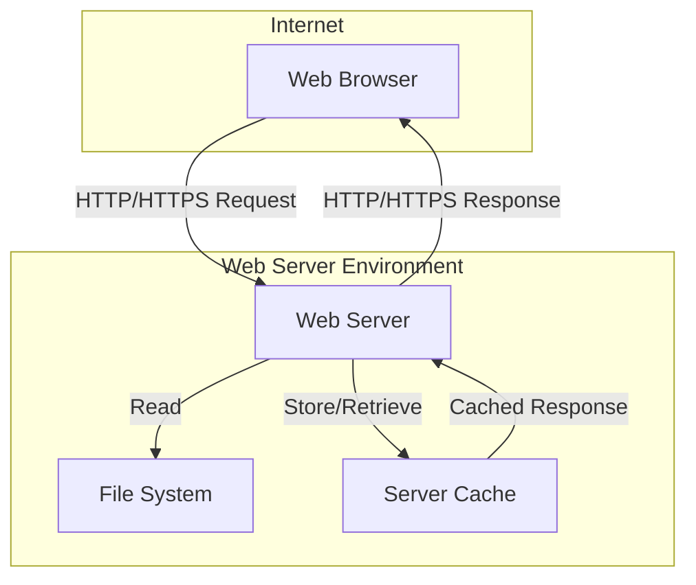

# Hello World Web Application

A production-ready, standards-compliant implementation of a Hello World web page demonstrating proper web development practices and system architecture.

## Project Overview

### Introduction
This project implements a simple yet robust "Hello World" web page, serving as a baseline for testing, learning, and system verification purposes. The implementation emphasizes web standards compliance while maintaining minimal complexity.

### Features
- Standards-compliant HTML5 implementation
- Cross-browser compatibility (Chrome 90+, Firefox 88+, Safari 14+, Edge 90+)
- Production-grade security headers and configurations
- Optimized caching strategy
- WCAG 2.1 Level A compliance
- Performance-optimized with <1s load time
- 99.9% uptime target

### Architecture Overview


## Quick Start

### Prerequisites
- Web server (Apache 2.4+ or Nginx 1.18+)
- SSL certificate (Let's Encrypt recommended)
- Text editor for HTML
- Git for version control

### Installation
1. Clone the repository:
   ```bash
   git clone https://github.com/your-org/hello-world-webapp.git
   ```

2. Configure web server:
   - For Apache:
     ```apache
     <VirtualHost *:80>
         ServerName yourdomain.com
         DocumentRoot /var/www/html
         Redirect permanent / https://yourdomain.com/
     </VirtualHost>
     ```
   - For Nginx:
     ```nginx
     server {
         listen 80;
         server_name yourdomain.com;
         return 301 https://$server_name$request_uri;
     }
     ```

3. Deploy HTML file:
   ```bash
   cp index.html /var/www/html/
   chmod 644 /var/www/html/index.html
   ```

### Basic Usage
1. Access the web page at `https://yourdomain.com`
2. Verify proper loading and display of "Hello World" message
3. Check browser developer tools for security headers and caching

## Technical Documentation

### System Architecture
The system employs a simple yet robust architecture:
- **Web Server Layer**: Handles HTTP requests and security
- **File System Layer**: Stores static HTML content
- **Cache Layer**: Optimizes response times
- **Security Layer**: Implements headers and protocols

### Technology Stack
- **Markup**: HTML5
- **Server**: Apache 2.4+ or Nginx 1.18+
- **Protocol**: HTTP/2 with TLS 1.2+
- **Tools**: W3C Validator, Browser DevTools
- **Monitoring**: Server logs, CloudWatch metrics

### Security Implementation
- **HTTP Security Headers**:
  ```
  Content-Security-Policy: default-src 'self'
  X-Frame-Options: DENY
  X-Content-Type-Options: nosniff
  Strict-Transport-Security: max-age=31536000
  Referrer-Policy: no-referrer
  ```
- **File Permissions**: 644 for files, 755 for directories
- **TLS Configuration**: Modern cipher suites only
- **Access Controls**: Rate limiting at 100 req/min

## Development

### Setup
1. Install development tools:
   - Modern web browser
   - Text editor with HTML support
   - Local web server

2. Configure local environment:
   ```bash
   # Create development directory
   mkdir hello-world-dev
   cd hello-world-dev
   
   # Initialize Git repository
   git init
   
   # Create initial files
   touch index.html
   ```

### Guidelines
- Follow HTML5 standards
- Validate HTML using W3C validator
- Maintain proper documentation
- Follow security best practices
- Use semantic HTML elements

### Testing
- Validate HTML: `https://validator.w3.org/`
- Test across browsers: Chrome, Firefox, Safari, Edge
- Verify security headers
- Check mobile responsiveness
- Validate accessibility

## Deployment

### Environments
- **Development**: Local development environment
- **Staging**: Pre-production testing
- **Production**: Live environment

### Procedures
1. Validate HTML and security configurations
2. Deploy to staging environment
3. Perform integration tests
4. Deploy to production
5. Verify deployment
6. Monitor performance

### Monitoring
- Server access logs
- Error logs
- Performance metrics
- Security alerts
- Uptime monitoring

## Contributing
1. Fork the repository
2. Create a feature branch
3. Commit changes
4. Push to the branch
5. Create Pull Request

## License
MIT License - See LICENSE file for details

## References
- [Web Application Documentation](src/web/README.md)
- [Infrastructure Documentation](infrastructure/README.md)
- [Deployment Guide](src/web/docs/deployment.md)
- [Development Guide](src/web/docs/development.md)
- [Security Guide](src/web/docs/security.md)

---
Version: 1.0.0  
Last Updated: 2024-01-22  
Maintainers: Technical Team  
Repository: hello-world-webapp