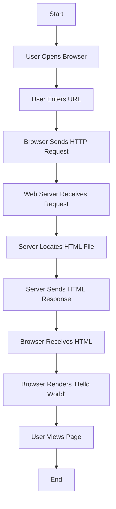
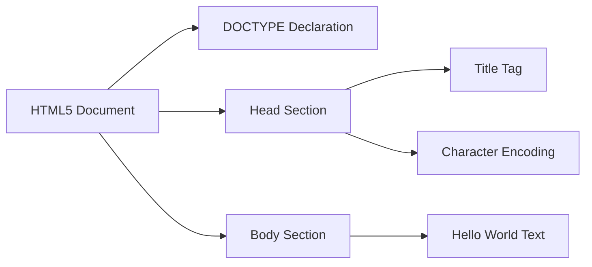
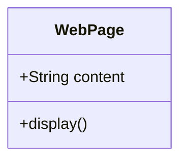
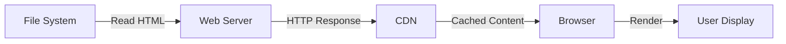
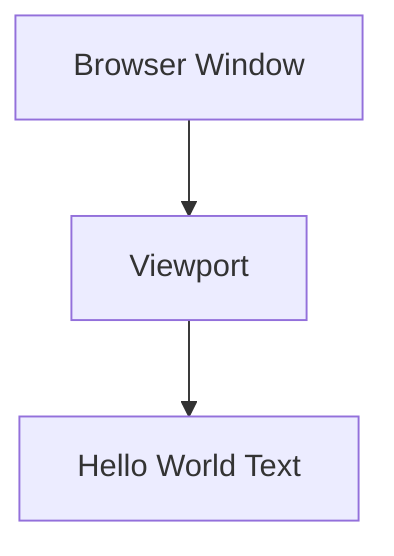

# Product Requirements Document (PRD)

# 1. INTRODUCTION

## 1.1 Purpose
This Product Requirements Document (PRD) specifies the requirements for developing a simple "Hello World" web page. The document serves as a reference for developers, stakeholders, and project team members involved in the implementation of this basic web application.

## 1.2 Scope
The project encompasses the development of a single static web page that displays the text "Hello World". The web page will:
- Consist of a single HTML file
- Display the greeting message "Hello World"
- Be accessible through standard web browsers
- Serve as a minimal demonstration of web page creation

The project explicitly excludes:
- Multiple pages or navigation
- Backend functionality
- User interaction features
- Database integration
- Authentication systems

# 2. PRODUCT DESCRIPTION

## 2.1 Product Perspective
The "Hello World" web page is a standalone, self-contained system that operates independently of other software systems. It represents the most basic form of a web page, serving as an entry-level example of web development. The page will be viewable through any standard web browser without requiring additional software or systems.

## 2.2 Product Functions
The web page provides the following core function:
- Display the text message "Hello World" in a web browser window

## 2.3 User Characteristics
The intended users of this web page include:
- Beginning web developers learning HTML basics
- Technical trainers demonstrating web development concepts
- Quality assurance testers verifying basic web functionality

No special technical expertise is required to view or use the web page, as it only requires basic familiarity with using a web browser.

## 2.4 Constraints
The following constraints apply to the project:
- Must use only HTML (no CSS or JavaScript)
- Must be compatible with modern web browsers (Chrome, Firefox, Safari, Edge)
- Must be contained within a single file
- File size must not exceed 1KB
- Must load and display in under 1 second

## 2.5 Assumptions and Dependencies
Assumptions:
- Users have access to a modern web browser
- Users have basic internet connectivity
- The web page will be served via standard HTTP/HTTPS protocols

Dependencies:
- Web server capability to serve static HTML files
- Browser compliance with HTML standards
- DNS resolution for web hosting (if deployed online)

# 3. PROCESS FLOWCHART

# 4. FUNCTIONAL REQUIREMENTS

## 4.1 Feature Breakdown

### Feature 1: Web Page Display
**ID**: F001  
**Description**: Basic HTML page that displays "Hello World"  
**Priority**: High  

### Feature 2: Browser Compatibility
**ID**: F002  
**Description**: Page renders correctly across modern web browsers  
**Priority**: High  

## 4.2 Requirements Table

| ID | Requirement | Description | Priority |
|----|------------|-------------|-----------|
| R001 | HTML File Creation | Create a single HTML file with proper HTML5 structure | High |
| R002 | Content Display | Display "Hello World" text in the browser window | High |
| R003 | File Size | Maintain file size under 1KB | Medium |
| R004 | Load Time | Ensure page loads in under 1 second | Medium |
| R005 | Browser Support | Support Chrome, Firefox, Safari, and Edge browsers | High |
| R006 | Valid HTML | Ensure HTML code passes W3C validation | Medium |
| R007 | Character Encoding | Use UTF-8 character encoding | Medium |
| R008 | HTTP Response | Return proper HTTP 200 status code when page is requested | High |

## 4.3 Technical Requirements

# 5. NON-FUNCTIONAL REQUIREMENTS

## 5.1 Performance
- Page load time must not exceed 1 second on standard broadband connections
- Server response time must be under 200ms
- HTML file size must remain under 1KB
- Memory usage in browser must not exceed 50MB
- Page must render completely within 500ms

## 5.2 Safety
- Page must gracefully degrade if JavaScript is disabled
- Browser timeout settings must be respected
- Error handling must prevent display of system-level error messages
- Page must maintain functionality during concurrent user access
- No data collection or storage occurs, minimizing data safety concerns

## 5.3 Security
- Must be servable over HTTPS protocol
- No user input handling required
- No cookies or local storage implementation
- HTTP headers must be properly configured to prevent XSS attacks
- Web server security headers must be implemented:
  - X-Content-Type-Options: nosniff
  - X-Frame-Options: DENY
  - Content-Security-Policy: default-src 'self'

## 5.4 Quality

### 5.4.1 Availability
- Page uptime must be 99.9%
- Must be accessible 24/7
- Must work offline when cached

### 5.4.2 Maintainability
- HTML code must be properly indented and formatted
- Comments must be included for any non-obvious markup
- File naming must follow standard conventions
- Documentation must be maintained for any changes

### 5.4.3 Usability
- Page must be readable at various zoom levels (50% to 200%)
- Must maintain readability with system font size changes
- Must be accessible via keyboard navigation
- Must meet WCAG 2.1 Level A compliance

### 5.4.4 Scalability
- Must support concurrent access from multiple users
- Must maintain performance under increased load
- Must be cacheable by CDNs

### 5.4.5 Reliability
- Zero tolerance for page crashes
- Must render consistently across all supported browsers
- Must maintain functionality during network fluctuations

## 5.5 Compliance
- Must conform to HTML5 standards
- Must pass W3C HTML validation
- Must comply with WCAG 2.1 Level A accessibility guidelines
- Must adhere to GDPR requirements (no user data collection)
- Must include appropriate meta tags for content type and character encoding

# 6. DATA REQUIREMENTS

## 6.1 Data Models
Given the static nature of this single-page "Hello World" application, there is no complex data model required. The only data element is the static text string "Hello World".

## 6.2 Data Storage
### 6.2.1 Primary Storage
- Single HTML file stored on web server file system
- File size < 1KB
- UTF-8 encoding required

### 6.2.2 Redundancy
- Standard web server file system backups
- CDN caching for improved availability
- Browser caching enabled via HTTP headers

### 6.2.3 Backup and Recovery
- Daily file system backups retained for 30 days
- Version control system for HTML file changes
- Recovery time objective (RTO): 5 minutes
- Recovery point objective (RPO): 24 hours

## 6.3 Data Processing

### 6.3.1 Data Security
- Read-only access to HTML file
- File permissions set to 644
- Web server directory permissions set to 755
- HTTP response headers properly configured:
  - Content-Type: text/html
  - X-Content-Type-Options: nosniff
  - Cache-Control: public, max-age=3600

# 7. EXTERNAL INTERFACES

## 7.1 User Interfaces
- The page will display "Hello World" using the system default font
- No custom styling or formatting required
- Text must be visible against browser's default background color
- Viewport must be responsive to browser window size

## 7.2 Hardware Interfaces
Not applicable for this simple static web page as it does not interact directly with any hardware components.

## 7.3 Software Interfaces
- Web Server Software
  - Apache 2.4+ or Nginx 1.18+
  - Must support serving static HTML files
  - Must handle HTTP/1.1 and HTTP/2 protocols
  - Must support standard MIME types

- Web Browsers
  - Chrome 90+
  - Firefox 88+
  - Safari 14+
  - Edge 90+
  - Must support HTML5
  - Must support UTF-8 character encoding

## 7.4 Communication Interfaces
- HTTP/HTTPS Protocol
  - HTTP/1.1 and HTTP/2 support required
  - Standard port 80 (HTTP) or 443 (HTTPS)
  - Must support GET requests
  - Must return proper HTTP status codes
  - Headers must include:
    - Content-Type: text/html
    - Content-Length
    - Last-Modified
    - ETag

| Protocol | Port | Purpose |
|----------|------|---------|
| HTTP | 80 | Standard web traffic |
| HTTPS | 443 | Secure web traffic |

# 8. APPENDICES

## 8.1 GLOSSARY
| Term | Definition |
|------|------------|
| Static Web Page | A web page that displays fixed content and does not change based on user input or dynamic data |
| HTML | HyperText Markup Language - The standard markup language for creating web pages |
| Web Browser | Software application used to access, retrieve and navigate information on the World Wide Web |
| Web Server | Computer software and hardware that accepts requests via HTTP to deliver web content |
| Viewport | The visible area of a web page on a display device |
| UTF-8 | Character encoding capable of encoding all possible characters in Unicode |

## 8.2 ACRONYMS
| Acronym | Definition |
|---------|------------|
| HTML | HyperText Markup Language |
| HTTP | HyperText Transfer Protocol |
| HTTPS | HyperText Transfer Protocol Secure |
| CDN | Content Delivery Network |
| DNS | Domain Name System |
| XSS | Cross-Site Scripting |
| WCAG | Web Content Accessibility Guidelines |
| GDPR | General Data Protection Regulation |
| RTO | Recovery Time Objective |
| RPO | Recovery Point Objective |
| W3C | World Wide Web Consortium |

## 8.3 ADDITIONAL REFERENCES
1. HTML5 Specification
   - https://html.spec.whatwg.org/
   - Authoritative source for HTML standards

2. W3C Markup Validation Service
   - https://validator.w3.org/
   - Tool for validating HTML code

3. Web Browser Market Share Statistics
   - https://gs.statcounter.com/browser-market-share
   - Current browser usage statistics

4. WCAG 2.1 Guidelines
   - https://www.w3.org/WAI/WCAG21/quickref/
   - Web accessibility requirements reference

5. HTTP Protocol Documentation
   - https://tools.ietf.org/html/rfc2616
   - Technical specification for HTTP/1.1