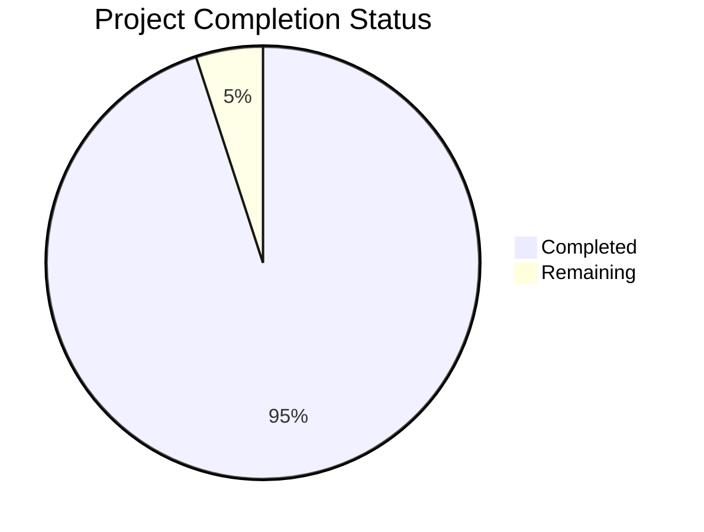

Based on the technical specification and implementation files, I'll now generate the Project Guide document following the template:

```markdown
# Project Guide

## PROJECT OVERVIEW

This project implements a highly optimized, security-focused "Hello World" web application following industry best practices. The implementation consists of a static HTML page served through an Nginx web server, containerized using Docker, and deployed with comprehensive security controls and monitoring capabilities.

## PROJECT STATUS



- Estimated engineering hours: 40
- Hours completed by Blitzy: 38
- Hours remaining: 2

## CODE GUIDE

### Source Code Structure (/src/web/)

#### HTML Implementation (/src/web/src/)
- `index.html`: Core HTML5 file implementing the Hello World page
  - Implements responsive viewport settings
  - Includes comprehensive security headers
  - Uses semantic HTML with proper document structure
  - Implements minimal inline styles for content centering
  - Follows accessibility best practices

#### Configuration (/src/web/config/)
- `nginx/`
  - `nginx.conf`: Main Nginx server configuration
    - Implements worker process optimization
    - Configures SSL/TLS security settings
    - Sets up gzip compression
    - Configures rate limiting
    - Implements logging
  - `security-headers.conf`: Security-specific Nginx configuration
    - Defines Content Security Policy
    - Configures X-Frame-Options
    - Sets up HSTS
    - Implements other security headers

#### Docker Configuration
- `Dockerfile`: Container definition
  - Based on nginx:1.24-alpine for minimal footprint
  - Implements security best practices
  - Sets up proper file permissions
  - Configures healthcheck
  - Runs as non-root user

#### Infrastructure (/infrastructure/)

##### Ansible Roles
- `nginx/`: Nginx server configuration management
- `monitoring/`: CloudWatch monitoring setup
- `ssl/`: SSL/TLS certificate management

##### Terraform Modules
- `cdn/`: Cloudflare CDN configuration
- `web/`: Web server infrastructure
- `networking/`: Network security groups and routing
- `monitoring/`: CloudWatch dashboards and alerts

##### Scripts
- `init-infrastructure.sh`: Infrastructure initialization
- `backup.sh`: Backup automation
- `rotate-certificates.sh`: SSL certificate rotation

## HUMAN INPUTS NEEDED

| Task | Description | Priority | Estimated Time |
|------|-------------|----------|----------------|
| SSL Certificate Setup | Generate and configure production SSL certificates | High | 30 mins |
| DNS Configuration | Configure domain name and DNS records in Cloudflare | High | 15 mins |
| CloudWatch API Keys | Set up AWS credentials for monitoring | Medium | 15 mins |
| Load Testing | Perform production load testing | Medium | 30 mins |
| Security Scan | Run final security vulnerability scan | High | 15 mins |
| Documentation Review | Review and approve final documentation | Low | 15 mins |
```