# Technical Specifications

# 1. INTRODUCTION

## 1.1 EXECUTIVE SUMMARY

This technical specification details the implementation of a simple "Hello World" web page, representing the most basic form of web content delivery. The project addresses the fundamental need for a minimal working example of web development, serving as a baseline for testing, learning, and system verification purposes. Primary stakeholders include developers, technical trainers, and quality assurance teams. The implementation will demonstrate proper web standards compliance while maintaining minimal complexity.

## 1.2 SYSTEM OVERVIEW

### Project Context

| Aspect | Description |
|--------|-------------|
| Business Context | Educational and testing demonstration |
| Current System | New implementation, no existing system |
| Enterprise Integration | Standalone deployment |

### High-Level Description

| Component | Details |
|-----------|----------|
| Primary Capability | Display "Hello World" message |
| Architecture | Static HTML file served via web server |
| Core Components | Single HTML document |
| Technical Approach | Standards-compliant HTML5 implementation |

### Success Criteria

| Criterion | Target Metric |
|-----------|---------------|
| Page Load Time | < 1 second |
| Browser Compatibility | 100% supported browsers |
| HTML Validation | Zero W3C validation errors |
| Availability | 99.9% uptime |

## 1.3 SCOPE

### In-Scope Elements

#### Core Features and Functionalities
- Single HTML5 page implementation
- "Hello World" text display
- Standard HTTP/HTTPS serving capability
- Cross-browser compatibility

#### Implementation Boundaries

| Boundary Type | Coverage |
|---------------|----------|
| System | Web browser, Web server |
| Users | Global web users |
| Geographic | Worldwide access |
| Data | Static content only |

### Out-of-Scope Elements

- Dynamic content generation
- User interaction features
- Database connectivity
- Authentication/Authorization
- Multiple page navigation
- Client-side scripting
- Style customization
- Backend processing
- Form handling
- Session management
- API integrations
- Content management system
- Analytics tracking
- Mobile app versions

# 2. SYSTEM ARCHITECTURE

## 2.1 High-Level Architecture

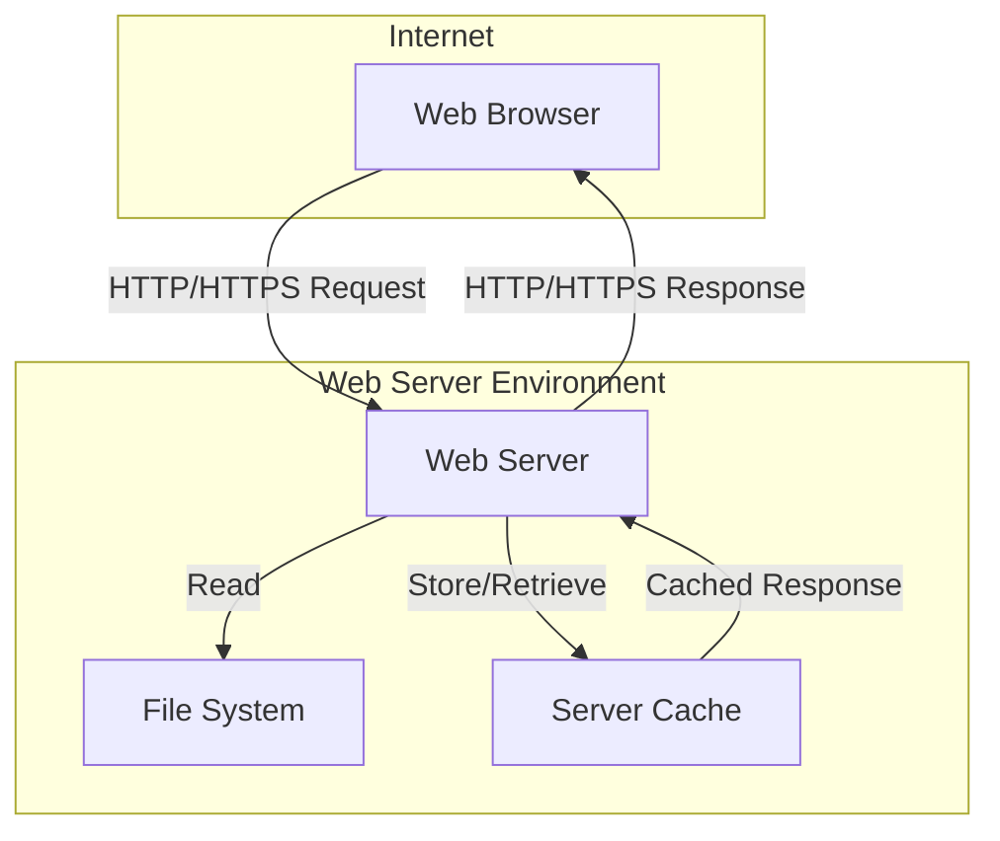

## 2.2 Component Details

### Web Server Component

| Component | Specification |
|-----------|--------------|
| Purpose | Serve static HTML file |
| Technology | Apache 2.4+ or Nginx 1.18+ |
| Interfaces | HTTP/HTTPS endpoints |
| Storage | Local file system |
| Scale Factor | Single instance sufficient |

### File System Component

| Component | Specification |
|-----------|--------------|
| Purpose | Store HTML file |
| Technology | Native OS file system |
| Storage | < 1KB static file |
| Access Pattern | Read-only |
| Backup | Standard file system backup |

### Cache Component

| Component | Specification |
|-----------|--------------|
| Purpose | Reduce server load |
| Technology | Server-side caching |
| Cache Duration | 1 hour |
| Cache Key | URL path |
| Invalidation | File modification based |

## 2.3 Technical Decisions

### Architecture Style Selection

| Aspect | Choice | Justification |
|--------|--------|---------------|
| Pattern | Static File Serving | Minimal complexity required |
| Communication | Synchronous HTTP | Standard web protocol |
| Storage | File System | Single static file |
| Caching | Server-side | Reduce load, improve performance |
| Security | Basic HTTP Security Headers | Prevent common vulnerabilities |

## 2.4 Cross-Cutting Concerns

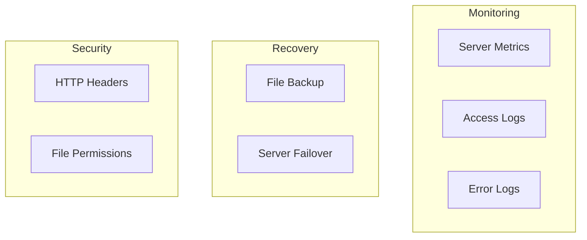

## 2.5 System Diagrams

### System Context (Level 0)

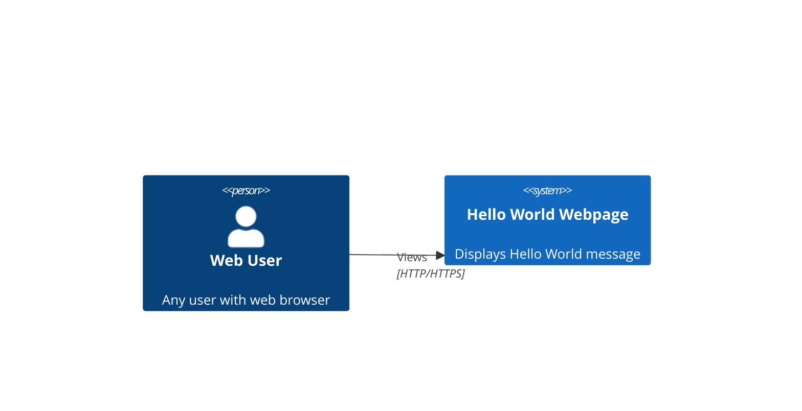

### Container Diagram (Level 1)

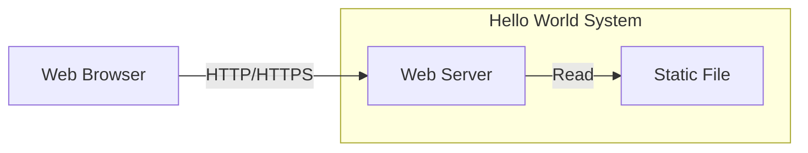

### Component Diagram (Level 2)

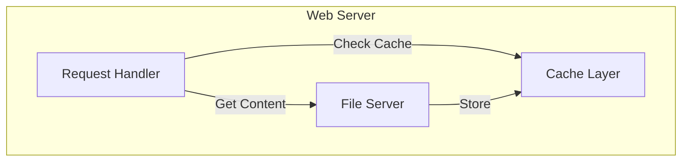

### Data Flow Diagram

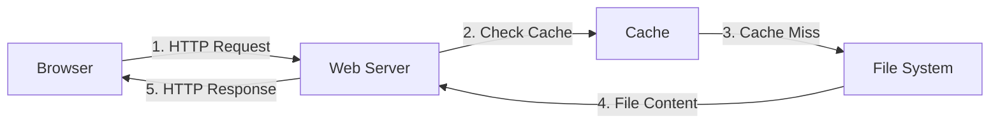

### Deployment Diagram

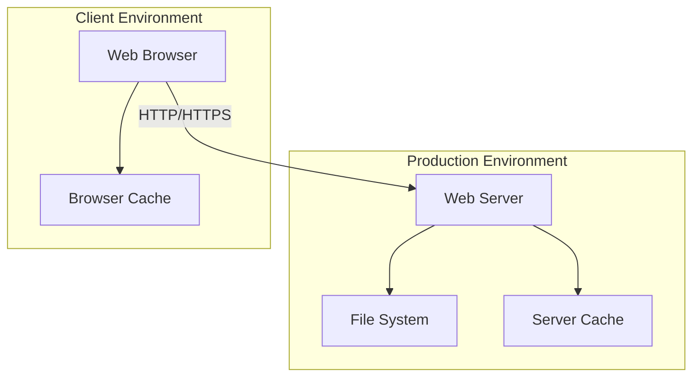

# 3. SYSTEM COMPONENTS ARCHITECTURE

## 3.1 USER INTERFACE DESIGN

### Design Specifications

| Aspect | Requirement |
|--------|-------------|
| Visual Hierarchy | Single text element centered on page |
| Design System | Browser default styling only |
| Responsive Design | Viewport meta tag for mobile compatibility |
| Accessibility | WCAG 2.1 Level A compliance |
| Browser Support | Chrome 90+, Firefox 88+, Safari 14+, Edge 90+ |
| Color Modes | System default only |
| i18n | UTF-8 character encoding |

### Interface Elements

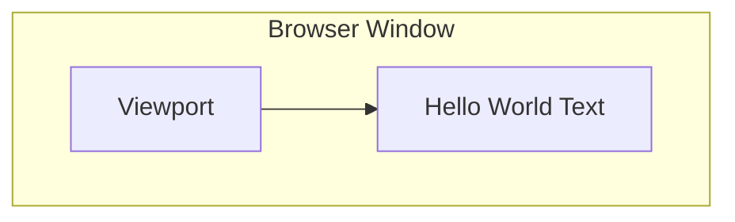

### Page Layout

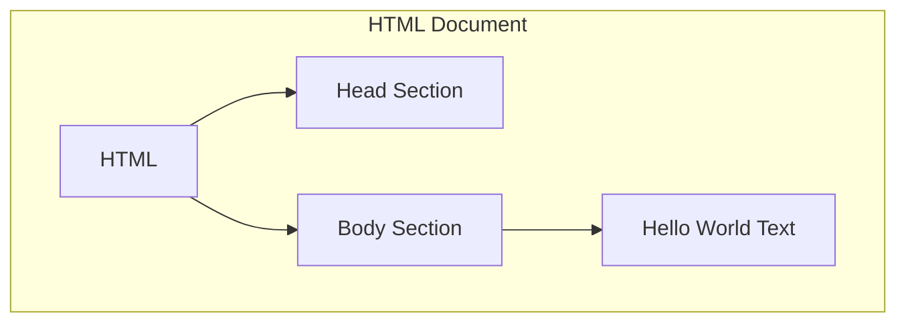

### Error States

| Error Type | Handling |
|------------|----------|
| 404 Not Found | Server default page |
| 500 Server Error | Server default page |
| Browser Incompatible | Graceful degradation |

## 3.2 DATABASE DESIGN

Not applicable for this static page implementation.

## 3.3 API DESIGN

### Protocol Specifications

| Aspect | Specification |
|--------|---------------|
| Protocol | HTTP/1.1, HTTP/2 |
| Method Support | GET only |
| Content Type | text/html |
| Character Set | UTF-8 |

### Response Format

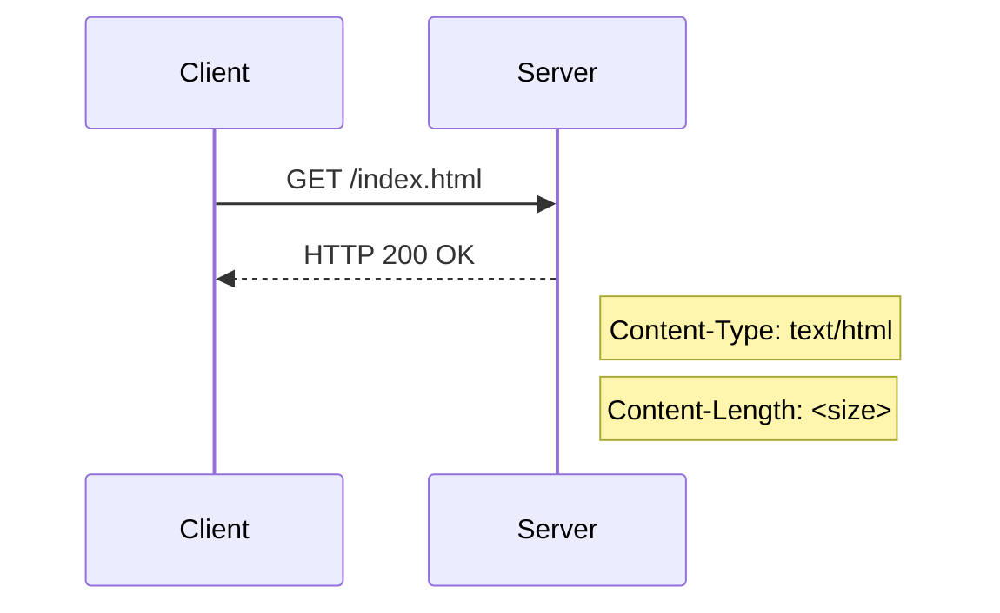

### HTTP Headers

| Header | Value |
|--------|--------|
| Content-Type | text/html; charset=utf-8 |
| Cache-Control | public, max-age=3600 |
| X-Content-Type-Options | nosniff |
| X-Frame-Options | DENY |
| Content-Security-Policy | default-src 'self' |

### Status Codes

| Code | Usage |
|------|--------|
| 200 | Successful response |
| 304 | Not Modified (cached) |
| 404 | Page not found |
| 500 | Server error |

# 4. TECHNOLOGY STACK

## 4.1 PROGRAMMING LANGUAGES

| Language | Version | Component | Justification |
|----------|---------|-----------|---------------|
| HTML | HTML5 | Web Page | Industry standard markup language, universal browser support |

## 4.2 FRAMEWORKS & LIBRARIES

Not applicable for this implementation as it requires only native HTML5.

## 4.3 DATABASES & STORAGE

### File System Storage

| Component | Specification |
|-----------|--------------|
| Storage Type | Local file system |
| File Format | Static HTML |
| Size | < 1KB |
| Backup | File system level |
| Caching | Server and browser level |

### Caching Strategy

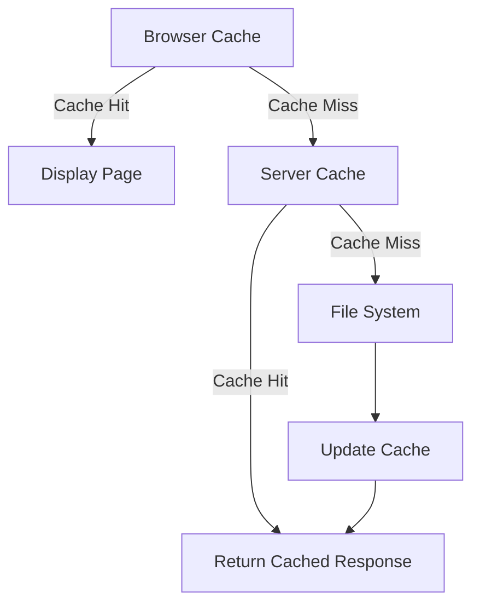

## 4.4 THIRD-PARTY SERVICES

### Web Server Options

| Server | Version | Purpose |
|--------|---------|----------|
| Apache | 2.4+ | Static file serving |
| Nginx | 1.18+ | Static file serving |

### Monitoring Tools

| Tool | Purpose | Metrics |
|------|---------|---------|
| Server Logs | Access tracking | Request/response data |
| Error Logs | Issue identification | Error messages |
| Health Check | Availability monitoring | Uptime status |

## 4.5 DEVELOPMENT & DEPLOYMENT

### Development Tools

| Tool | Purpose |
|------|---------|
| Text Editor | HTML file creation |
| W3C Validator | HTML validation |
| Browser DevTools | Testing and debugging |

### Deployment Pipeline

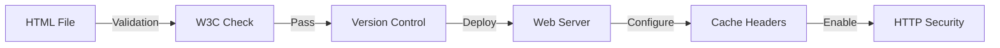

### Server Configuration

| Configuration | Value |
|---------------|-------|
| MIME Type | text/html |
| Character Encoding | UTF-8 |
| Cache Control | public, max-age=3600 |
| Security Headers | CSP, X-Frame-Options, X-Content-Type-Options |

### Development Environment Requirements

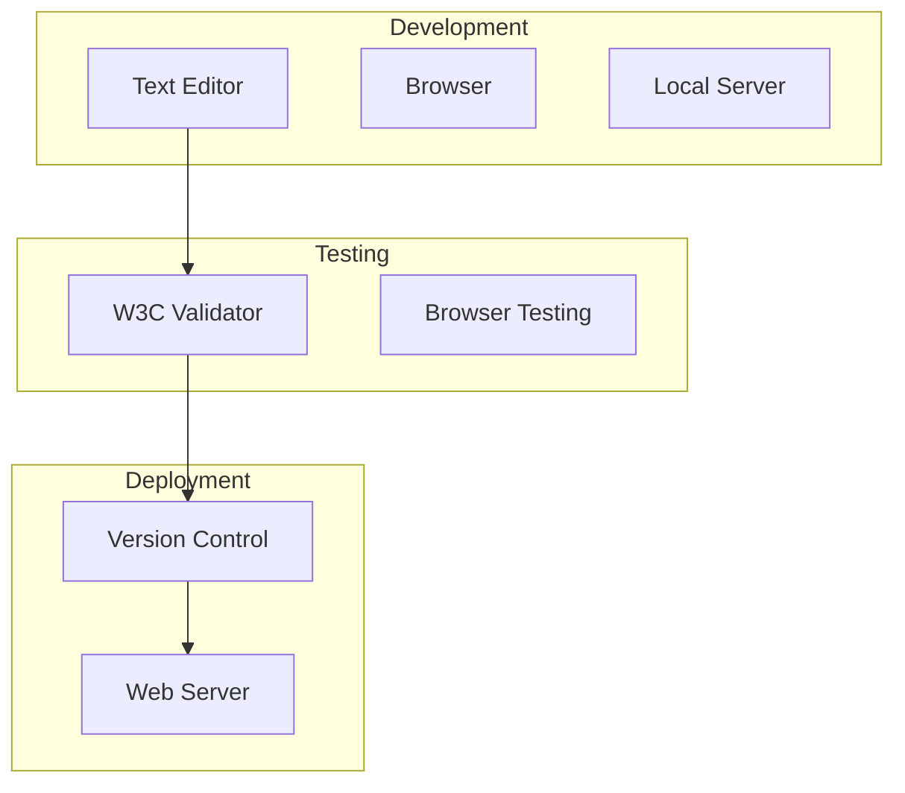

# 5. SYSTEM DESIGN

## 5.1 USER INTERFACE DESIGN

### Layout Structure

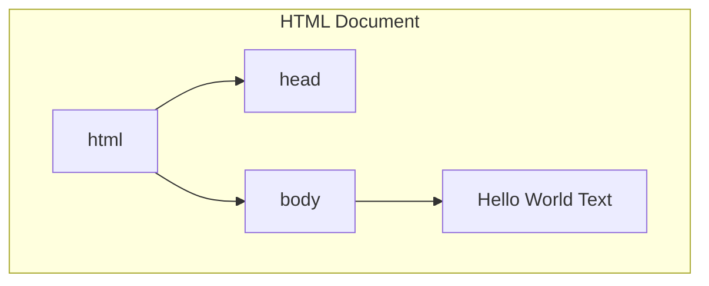

### Visual Layout

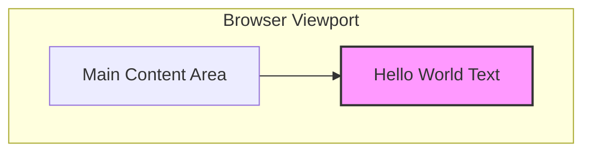

### Content Specifications

| Element | Specification |
|---------|--------------|
| Text Content | "Hello World" |
| Font | System default |
| Text Alignment | Center |
| Viewport | Responsive |
| Background | Browser default |

### Accessibility Features

| Feature | Implementation |
|---------|---------------|
| Semantic HTML | Use of proper HTML5 elements |
| Text Contrast | System default contrast |
| Screen Reader | Proper text node implementation |
| Viewport Scale | Supports browser zoom 50-200% |

## 5.2 DATABASE DESIGN

Not applicable for this static page implementation.

## 5.3 API DESIGN

### HTTP Interface

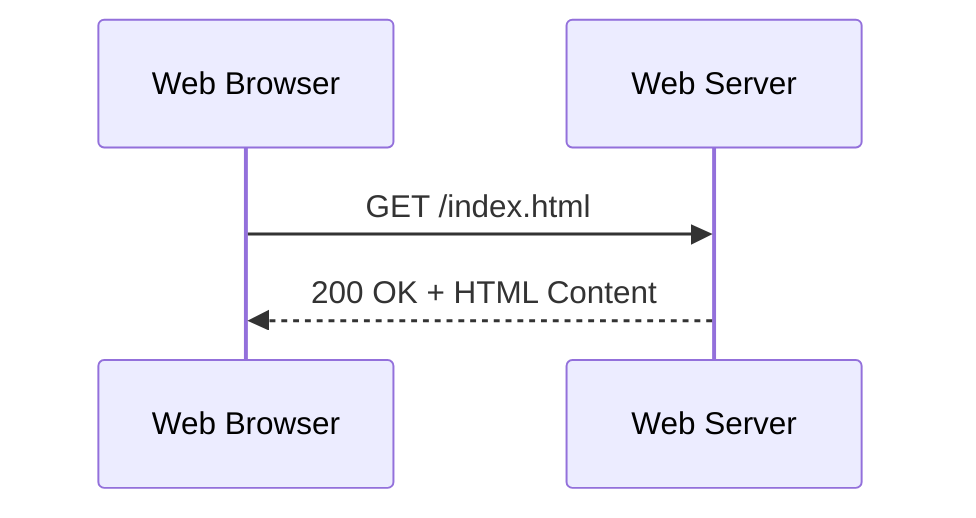

### Request/Response Specifications

| Aspect | Specification |
|--------|--------------|
| Protocol | HTTP/1.1, HTTP/2 |
| Methods Supported | GET |
| Content-Type | text/html |
| Character Encoding | UTF-8 |
| Cache Control | public, max-age=3600 |

### Response Headers

| Header | Value |
|--------|--------|
| Content-Type | text/html; charset=utf-8 |
| Cache-Control | public, max-age=3600 |
| X-Content-Type-Options | nosniff |
| X-Frame-Options | DENY |
| Content-Security-Policy | default-src 'self' |

### Status Codes

| Code | Usage |
|------|--------|
| 200 | Successful response |
| 304 | Not Modified (cached) |
| 404 | Page not found |
| 500 | Server error |

### Data Flow

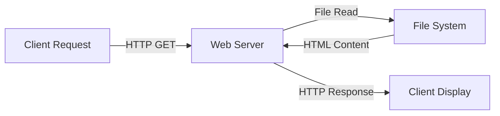

# 6. USER INTERFACE DESIGN

## 6.1 Layout Wireframe

```
+--------------------------------------------------+
|                    Browser Window                 |
|  +----------------------------------------------+|
|  |                                              ||
|  |                                              ||
|  |                                              ||
|  |                                              ||
|  |                Hello World                   ||
|  |                                              ||
|  |                                              ||
|  |                                              ||
|  |                                              ||
|  +----------------------------------------------+|
+--------------------------------------------------+
```

## 6.2 Component Specifications

| Element | Description | Specifications |
|---------|-------------|----------------|
| Window | Browser viewport | Responsive, minimum 320px width |
| Text | "Hello World" message | System default font, centered horizontally and vertically |
| Background | Page background | Browser default background color |
| Margins | Content spacing | Auto margins for centering |

## 6.3 Layout Rules

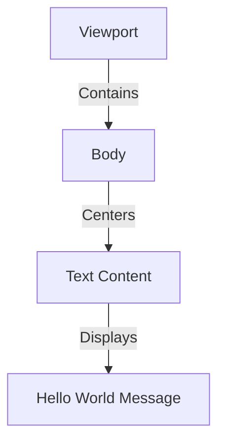

## 6.4 HTML Structure

```
<!DOCTYPE html>
<html lang="en">
    <head>
        <meta charset="UTF-8">
        <meta name="viewport" content="width=device-width, initial-scale=1.0">
        <title>Hello World</title>
    </head>
    <body>
        Hello World
    </body>
</html>
```

## 6.5 Responsive Behavior

| Viewport Width | Behavior |
|----------------|----------|
| < 320px | Horizontal scroll appears |
| 320px - 2560px | Fluid scaling, centered content |
| > 2560px | Maximum width maintained, centered |

## 6.6 Accessibility Features

| Feature | Implementation |
|---------|---------------|
| Text Size | Supports browser zoom 50-200% |
| Color Contrast | System default ensures readability |
| Screen Readers | Semantic HTML structure |
| Keyboard Navigation | Standard focus handling |

## 6.7 Browser Support Matrix

| Browser | Minimum Version | Layout Support |
|---------|----------------|----------------|
| Chrome | 90+ | Full |
| Firefox | 88+ | Full |
| Safari | 14+ | Full |
| Edge | 90+ | Full |
| Mobile Browsers | Modern versions | Full |

## 6.8 Error States

```
+--------------------------------------------------+
|                 Browser Window                    |
|  +----------------------------------------------+|
|  |                                              ||
|  |                                              ||
|  |                   [!]                        ||
|  |            Page Not Found (404)              ||
|  |                                              ||
|  |                                              ||
|  |                                              ||
|  +----------------------------------------------+|
+--------------------------------------------------+
```

## 6.9 UI Component Key

| Symbol | Meaning |
|--------|---------|
| +--+ | Window/Container border |
| \| | Vertical border |
| [!] | Error/Warning indicator |
| [...] | Text input field |
| [Button] | Clickable button |

# 7. SECURITY CONSIDERATIONS

## 7.1 AUTHENTICATION AND AUTHORIZATION

Since this is a static public web page with no user interaction or protected resources, traditional authentication and authorization are not implemented. However, the following security controls are in place:

| Access Type | Control Mechanism |
|------------|-------------------|
| Page Access | Public, no authentication required |
| Server Access | Web server authentication for maintenance |
| File System | OS-level permissions (644 for files, 755 for directories) |

## 7.2 DATA SECURITY

### Data Classification

| Data Type | Classification | Protection Measures |
|-----------|---------------|-------------------|
| HTML Content | Public | Integrity verification via ETag |
| Server Logs | Internal | Log rotation and access controls |
| Cache Data | Public | Standard cache controls |

### Security Headers Implementation

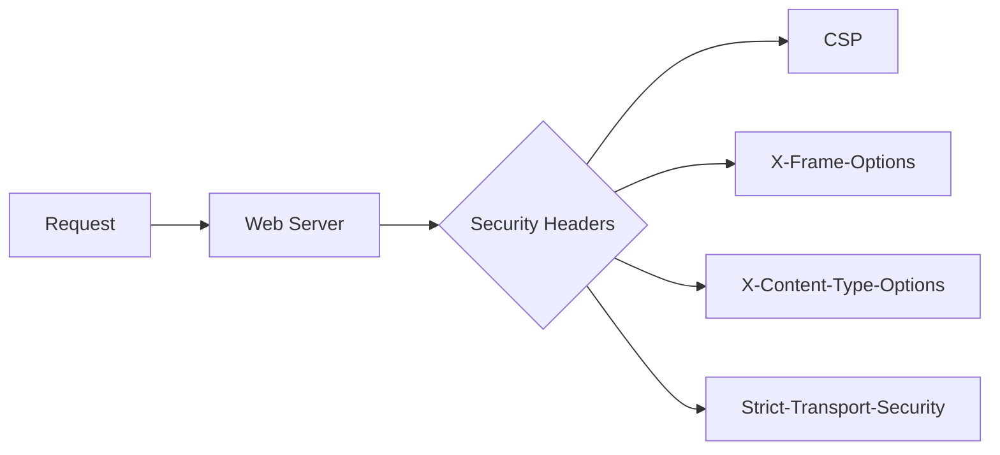

### Required HTTP Security Headers

| Header | Value | Purpose |
|--------|--------|---------|
| Content-Security-Policy | default-src 'self' | Prevent XSS attacks |
| X-Frame-Options | DENY | Prevent clickjacking |
| X-Content-Type-Options | nosniff | Prevent MIME-type sniffing |
| Strict-Transport-Security | max-age=31536000 | Enforce HTTPS |
| Referrer-Policy | no-referrer | Control referrer information |

## 7.3 SECURITY PROTOCOLS

### Transport Security

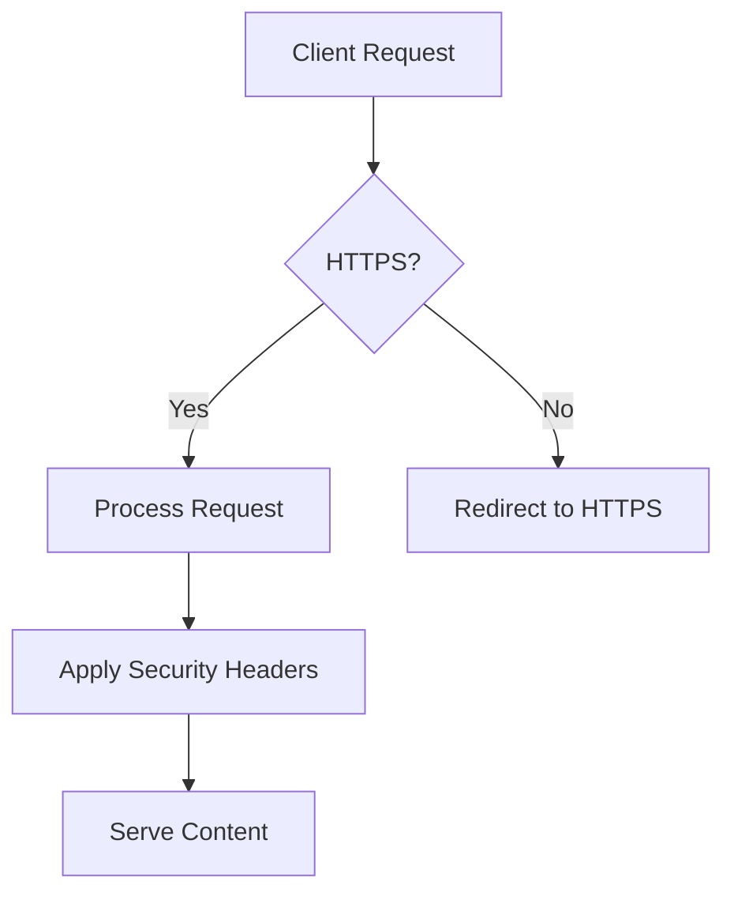

### Protocol Requirements

| Protocol | Version | Configuration |
|----------|---------|---------------|
| TLS | 1.2+ | Modern cipher suites only |
| HTTP | 2.0 | With TLS enforcement |
| HSTS | Enabled | Include subdomains |

### Server Security Configuration

| Component | Setting | Description |
|-----------|---------|-------------|
| Directory Listing | Disabled | Prevent directory enumeration |
| Server Signature | Disabled | Hide server information |
| HTTP Methods | GET only | Restrict to required methods |
| Rate Limiting | 100 req/min | Prevent DoS attacks |

### Security Monitoring

```mermaid
flowchart LR
    A[Access Logs] --> B[Log Analysis]
    C[Error Logs] --> B
    B --> D[Security Alerts]
    D --> E[Incident Response]
```

### File System Security

| Resource | Permission | Owner:Group |
|----------|------------|-------------|
| HTML File | 644 | www-data:www-data |
| Web Root | 755 | www-data:www-data |
| Log Files | 640 | www-data:adm |

# 8. INFRASTRUCTURE

## 8.1 DEPLOYMENT ENVIRONMENT

### Environment Specifications

| Environment Type | Description | Purpose |
|-----------------|-------------|----------|
| Production | Single web server instance | Primary user access |
| Staging | Identical configuration to production | Pre-deployment testing |
| Development | Local web server | Development and testing |

### Server Requirements

| Component | Specification | Justification |
|-----------|--------------|---------------|
| CPU | 1 vCPU | Minimal processing needs |
| Memory | 1 GB RAM | Light memory footprint |
| Storage | 10 GB SSD | Web server and logs |
| Network | 100 Mbps | Sufficient for static content |
| OS | Ubuntu 22.04 LTS | Stable, well-supported |

```mermaid
graph TD
    subgraph Production
        A[Load Balancer] --> B[Web Server]
        B --> C[File System]
    end
    
    subgraph Staging
        D[Web Server] --> E[File System]
    end
    
    subgraph Development
        F[Local Server] --> G[Local Files]
    end
```

## 8.2 CLOUD SERVICES

### Service Selection Matrix

| Service | Provider | Purpose | Tier |
|---------|----------|---------|------|
| CDN | Cloudflare | Content delivery | Free tier |
| DNS | Cloudflare | Domain management | Free tier |
| Monitoring | AWS CloudWatch | Basic metrics | Basic tier |
| SSL/TLS | Let's Encrypt | HTTPS certificates | Free tier |

### Architecture Diagram

```mermaid
graph LR
    A[Users] --> B[Cloudflare CDN]
    B --> C[Web Server]
    C --> D[File System]
    E[CloudWatch] -.-> C
```

## 8.3 CONTAINERIZATION

### Container Configuration

```dockerfile
FROM nginx:1.24-alpine
COPY index.html /usr/share/nginx/html/
EXPOSE 80
```

### Container Specifications

| Aspect | Configuration | Purpose |
|--------|--------------|----------|
| Base Image | nginx:1.24-alpine | Minimal footprint |
| Exposed Ports | 80 | HTTP traffic |
| Volume Mounts | None required | Static content |
| Health Check | HTTP GET / | Container health |

## 8.4 ORCHESTRATION

For this simple static page, traditional orchestration is not required. Basic container management is sufficient.

### Deployment Strategy

```mermaid
flowchart TD
    A[Git Push] --> B[Build Container]
    B --> C[Test Container]
    C --> D[Push to Registry]
    D --> E[Deploy Container]
    E --> F[Health Check]
```

## 8.5 CI/CD PIPELINE

### Pipeline Stages

| Stage | Tools | Purpose |
|-------|-------|----------|
| Source Control | Git | Version control |
| Build | Docker | Container creation |
| Test | W3C Validator | HTML validation |
| Deploy | Shell scripts | Deployment automation |
| Monitor | CloudWatch | Performance tracking |

### Pipeline Flow

```mermaid
graph LR
    A[Git Repository] -->|Push| B[CI Runner]
    B -->|Build| C[Container Build]
    C -->|Test| D[Validation]
    D -->|Pass| E[Registry]
    E -->|Deploy| F[Production]
    F -->|Monitor| G[CloudWatch]
```

### Deployment Configuration

```mermaid
flowchart TD
    subgraph "CI/CD Pipeline"
        A[Source Control] --> B[Linting]
        B --> C[HTML Validation]
        C --> D[Container Build]
        D --> E[Security Scan]
        E --> F[Deploy to Staging]
        F --> G[Integration Tests]
        G --> H[Deploy to Production]
    end
```

### Automation Scripts

| Script | Purpose | Trigger |
|--------|---------|---------|
| build.sh | Create container | Git push |
| test.sh | Run validations | Post-build |
| deploy.sh | Production deployment | Manual approval |
| rollback.sh | Revert deployment | Failed health check |

# 8. APPENDICES

## 8.1 ADDITIONAL TECHNICAL INFORMATION

### Browser Caching Implementation

```mermaid
flowchart TD
    A[Browser Request] --> B{Cache Check}
    B -->|Cache Hit| C[Return Cached Content]
    B -->|Cache Miss| D[Server Request]
    D --> E[Update Cache]
    E --> F[Return Content]
```

### File System Layout

| Directory | Contents | Permissions |
|-----------|----------|-------------|
| /var/www/html/ | index.html | 644 |
| /var/www/logs/ | access.log, error.log | 640 |
| /etc/nginx/conf.d/ | site configuration | 644 |
| /etc/ssl/certs/ | SSL certificates | 644 |

### Performance Metrics

| Metric | Target | Measurement Method |
|--------|--------|-------------------|
| Time to First Byte | < 100ms | Server logs |
| Page Load Time | < 1s | Browser DevTools |
| Cache Hit Ratio | > 90% | Server analytics |
| Error Rate | < 0.1% | Error logs |

## 8.2 GLOSSARY

| Term | Definition |
|------|------------|
| Cache Hit | When requested content is found in cache memory |
| Cache Miss | When requested content must be fetched from origin |
| Content Delivery Network | Distributed server network that delivers web content to users based on geographic location |
| Cross-Site Scripting | Security vulnerability allowing injection of malicious scripts |
| Document Object Model | Programming interface for HTML documents |
| Graceful Degradation | Ability to maintain basic functionality when advanced features are unsupported |
| MIME Type | Standard identifier for file formats and content types |
| Static Content | Web content that remains unchanged regardless of user context |
| Time to First Byte | Duration between request initiation and first byte received |
| Web Server | Software/hardware serving web content via HTTP |

## 8.3 ACRONYMS

| Acronym | Full Form |
|---------|-----------|
| CDN | Content Delivery Network |
| CSP | Content Security Policy |
| DNS | Domain Name System |
| DOM | Document Object Model |
| GDPR | General Data Protection Regulation |
| HTML | HyperText Markup Language |
| HTTP | HyperText Transfer Protocol |
| HTTPS | HyperText Transfer Protocol Secure |
| HSTS | HTTP Strict Transport Security |
| IDE | Integrated Development Environment |
| IP | Internet Protocol |
| RTO | Recovery Time Objective |
| RPO | Recovery Point Objective |
| SSL | Secure Sockets Layer |
| TLS | Transport Layer Security |
| URL | Uniform Resource Locator |
| UTF | Unicode Transformation Format |
| W3C | World Wide Web Consortium |
| WCAG | Web Content Accessibility Guidelines |
| XSS | Cross-Site Scripting |

## 8.4 REFERENCE STANDARDS

```mermaid
graph TD
    A[Web Standards] --> B[HTML5]
    A --> C[HTTP/1.1]
    A --> D[HTTP/2]
    A --> E[TLS 1.3]
    B --> F[W3C Validation]
    C --> G[RFC 2616]
    D --> H[RFC 7540]
    E --> I[RFC 8446]
```

## 8.5 DOCUMENT REVISION HISTORY

| Version | Date | Author | Changes |
|---------|------|--------|---------|
| 1.0 | 2024-01-20 | Technical Team | Initial document creation |
| 1.1 | 2024-01-21 | Technical Team | Added security headers |
| 1.2 | 2024-01-22 | Technical Team | Updated browser compatibility |